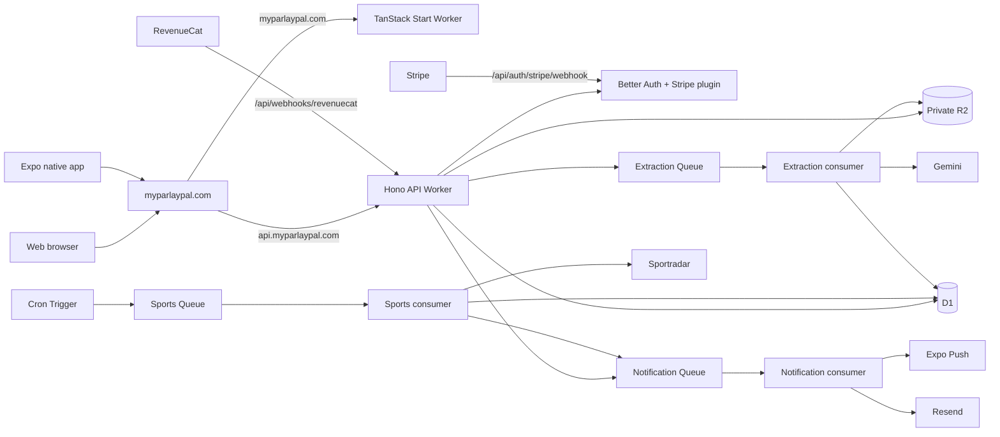

# ParlayPal backend migration architecture

Status: implemented backend architecture and migration record  
Date: 2026-09-10  
Source application: `/Users/newrgm/dev/RocktownLabs/projects/parlay-pal`  
Target application: `/Users/newrgm/dev/RocktownLabs/projects/ppal`

## Executive decision

Port the product as a Cloudflare-native TypeScript system while preserving the legacy application's domain boundaries and its most important scaling invariant: ingest a sports observation once, then fan it out to every matching ticket leg.

The initial production topology should use:

- a TanStack Start Worker for the website at `https://myparlaypal.com`;
- a Hono API Worker at `https://api.myparlaypal.com` with credentialed CORS for the web origin;
- one D1 database for Better Auth, billing read models, product data, and operational state;
- one private R2 bucket for slip images and avatars;
- Cloudflare Queues for slip extraction, sports polling/evaluation, and notification fan-out;
- Cron Triggers for schedule synchronization and selecting due live events;
- Better Auth 1.7.x with the Expo, Stripe, Google OAuth, email/password, email-verification, passkey, and two-factor capabilities required by the product;
- Stripe Checkout and the Better Auth Stripe plugin for web subscriptions;
- RevenueCat webhooks as a parallel native-store billing source, normalized into one application entitlement read model;
- Cloudflare Rate Limiting and Analytics Engine for burst protection and low-cost operational telemetry;
- Alchemy as the owner of Cloudflare infrastructure, domains, bindings, queues, and deploy-time secrets.

Durable Objects, KV, Workflows, and a separate Postgres database are intentionally absent from this slice. Revisit a per-user Durable Object only if measured SSE fan-out makes D1 polling materially expensive. Revisit Workflows only if imports need to exceed the current 100-file bounded batch contract.

## What the legacy application does

ParlayPal is a sportsbook-independent companion for bets placed elsewhere. It does not accept wagers, move funds, calculate bankroll, or recommend bets.

Its core loop is:

```text
private slip upload
  -> reserve one processing unit
  -> asynchronous Gemini extraction
  -> persist raw extraction and normalized candidate data
  -> create a needs-review ticket and legs
  -> user corrects and confirms
  -> resolve legs to canonical sports entities, events, and markets
  -> create shared tracking subscriptions
  -> poll each live sports event once
  -> normalize observations
  -> evaluate every subscribed leg deterministically
  -> evaluate the parent ticket
  -> append timeline entries and dispatch notifications
  -> build user analytics from settled history
```

There is a second ingestion mode for historical slips. Those uploads are extracted in the same way but settled against final provider data when possible. Results carry an explicit provenance and verification level so provider-verified records remain distinguishable from outcomes read from a settled slip or entered manually.

### Product capabilities to preserve

| Domain | Legacy behavior that must survive the port |
| --- | --- |
| Identity | Email/password, email verification, Google sign-in, passkeys, 2FA, password reset, web sessions, native authentication, onboarding, admin flag |
| Profiles | Unique usernames, public/private profiles, bio/avatar, follows, referrals, public record and verification counts |
| Uploads | Private JPG/PNG/WebP/PDF storage, SHA-256 deduplication, processing states, ownership checks, bounded cleanup |
| Extraction | Swappable extractor interface, Gemini implementation, schema-versioned raw and normalized responses, retries, telemetry |
| Tickets | Live and historical modes, review before tracking, ticket/leg state machines, editable legs, event hints |
| Sports | Provider abstraction, canonical sports/leagues/participants/markets/events, Sportradar playbooks across team, combat, racing, golf, and tennis sports |
| Tracking | Shared subscriptions, normalized observations, early wins where mathematically safe, final-only losses/unders, moneyline/spread evaluation, ticket settlement |
| History | Provider verification, partial verification, slip/manual provenance, bulk Creator imports, import progress and deduplication |
| Notifications | In-app and Expo push today, email when entitled, per-user event preferences, unread state |
| Billing | Free/Pro/Creator plans, monthly/yearly web subscriptions, native-store purchases, plan-derived features, usage caps, processing priority |
| Analytics | Player/team/sport/market/ticket-size/streak aggregates and plan-gated visibility |

### Current legacy state machines

```text
Upload: pending -> processing -> extracted | failed

Ticket: needs_review -> scheduled -> live -> won | lost | push | partially_void

Leg: pending -> live -> won | lost | push | void | cancelled | unresolved

Resolver: resolved | ambiguous | not_found | unsupported

Event: scheduled -> live -> final
                    \-> postponed | cancelled

Verification: unverified | partially_verified | verified
Result source: live_provider | historical_provider | settled_slip | manual
```

These should become shared TypeScript literal schemas used by database code, Hono validation, TanStack clients, and the native client. Database `CHECK` constraints should enforce durable status values; TypeScript types alone are insufficient.

## Target topology



### Domain routing

The implemented production split is:

- `myparlaypal.com/*` -> TanStack Start Worker
- `api.myparlaypal.com/*` -> Hono API Worker
- `www.myparlaypal.com/*` -> permanent redirect to the apex

The API Worker permits only the configured web origin with credentials and gives Better Auth one canonical production URL. A future same-origin `/api/*` route can remove CORS without changing the Hono route contracts.

Alchemy must adopt an existing route or DNS record only after a read-only inventory confirms the exact target. It must never automatically take over unrelated records on the zone.

## Cloudflare resource decisions

### Workers

Keep the web and API Workers separate. The API Worker owns Hono routing, Better Auth, request validation, authorization, idempotency, and queue production. Queue consumers may begin as named entrypoints in the backend deployment but should remain separate modules with small bindings.

Construct the Better Auth instance once per isolate, not repeatedly in multiple middleware calls during one request. The current scaffold calls `createAuth()` in both logging middleware and the auth route.

### D1

D1 remains the recommended first database because the current target already uses it, the product is relational, Better Auth supports SQLite/Drizzle, and the expected initial workload does not justify an external database.

Use D1 deliberately:

- never port Laravel `lockForUpdate()` or interactive transaction closures literally;
- express quota reservations as one conditional `INSERT ... SELECT` statement, protected by a unique idempotency key;
- use D1 `batch()` when several statements must succeed or roll back together;
- make all queue consumers idempotent because queue delivery is at least once;
- add a unique observation identity, such as `(provider, provider_event_id, participant_id, market_id, provider_sequence)`, so retries cannot double-apply a stat;
- append a unique transition/delivery key to timeline and notification rows so reprocessing cannot send the same milestone twice;
- store timestamps as integer milliseconds consistently;
- use opaque text IDs for user-owned/public resources and compact integer IDs where appropriate for internal catalogs or high-volume observation rows.

Move analytics toward maintained aggregate tables rather than repeatedly scanning all observation history. The source-of-truth ticket and leg rows stay normalized; queue consumers update per-user/per-dimension aggregates after settlement.

### R2

All slips and avatars are private R2 objects. D1 stores only metadata and an object key. API responses must not expose raw storage keys as usable URLs.

Recommended upload flow:

1. Client requests an upload intent with filename, MIME type, byte size, and optional client-computed SHA-256.
2. API validates entitlement and metadata, reserves usage idempotently, and creates a pending upload row.
3. Client streams bytes to an authenticated upload endpoint that writes directly to R2.
4. API marks the object ready and enqueues only the upload ID.
5. Failed or abandoned intents are released and removed by scheduled cleanup.

Keep the existing product limits configurable. Enforce type and size server-side, inspect the first bytes rather than trusting `Content-Type`, generate object keys server-side, and apply an R2 lifecycle policy appropriate to product/legal retention decisions.

### Queues

Use distinct queues because their upstream limits, priorities, retry behavior, and failure handling differ:

| Queue | Message | Consumer responsibility |
| --- | --- | --- |
| `slip-extraction-high` | `{ uploadId }` | Creator/high-priority extraction |
| `slip-extraction-priority` | `{ uploadId }` | Pro extraction |
| `slip-extraction-default` | `{ uploadId }` | Free extraction |
| `sports-poll` | `{ eventId, provider }` | Fetch one shared event, normalize observations, evaluate affected legs |
| `notifications` | `{ deliveryId }` | Deliver an already-persisted in-app/email/push notification |
| `historical-import` | `{ batchId, objectKey }` | Deduplicate, reserve usage, extract, and settle one historical slip |

Every primary queue needs a dead-letter queue and a small operational view for replaying or resolving failed work. Queue messages contain identifiers, not images, secrets, or full provider payloads. Limit extraction and sports-consumer concurrency to protect Gemini and Sportradar quotas; notification delivery can scale independently.

### Cron Triggers

Use cron as a selector, not as the place where all work happens:

- every minute: advance due scheduled events and enqueue due active-event polls;
- scheduled per league: synchronize upcoming schedules;
- periodically: clean abandoned uploads and stale usage reservations;
- periodically: reconcile subscription and entitlement anomalies;
- periodically: recompute or verify analytics aggregates.

The selector queries `next_poll_at` and atomically claims a due event before enqueueing it. Polling cadence is a property of a shared event and should reflect the highest entitled cadence among its active subscribers. Never create one recurring poller per ticket or user.

### Durable Objects, Workflows, KV, and Analytics Engine

Defer these initially:

- Durable Objects become useful for a per-event single writer, WebSocket/SSE hub, or heavily contended quota coordinator. D1 conditional writes and idempotent queues are enough for the first version.
- Workflows are attractive for long-running Creator imports or provider jobs that must sleep and resume. Start with explicit D1 batch state plus queues so the product behavior remains easy to inspect and replay.
- KV is not authoritative enough for entitlements, usage, ticket state, or username uniqueness. It can later cache public profiles or configuration.
- Analytics Engine is useful for operational telemetry, not as the source of truth for user-facing betting records.

## Backend module boundaries

The PHP service layout is good and should be preserved conceptually without reproducing Laravel framework coupling.

```text
apps/server/src/
  index.ts                       # Hono composition only
  routes/
    auth.ts
    billing.ts
    uploads.ts
    tickets.ts
    profiles.ts
    analytics.ts
    notifications.ts
    referrals.ts
    webhooks.ts
  middleware/
    auth.ts
    entitlement.ts
    idempotency.ts
    errors.ts
  consumers/
    extraction.ts
    sports.ts
    notifications.ts
    historical-import.ts
  scheduled/
    live-events.ts
    schedule-sync.ts
    cleanup.ts

packages/
  auth/                          # Better Auth config and auth-derived types
  db/
    src/schema/auth.ts
    src/schema/billing.ts
    src/schema/catalog.ts
    src/schema/tickets.ts
    src/schema/tracking.ts
    src/schema/identity.ts
    src/schema/notifications.ts
    src/schema/analytics.ts
    src/repositories/            # persistence only
  domain/
    src/tickets/                 # states and deterministic ticket evaluation
    src/tracking/                # leg evaluators by operator/market
    src/billing/                 # plans, entitlements, quota policy
    src/sports/                  # canonical DTOs and provider contract
    src/extraction/              # extractor contract, schemas, normalizer
    src/history/
  integrations/
    src/gemini/
    src/sportradar/
    src/stripe/
    src/revenuecat/
    src/expo/
    src/resend/
  contracts/                     # Zod API request/response contracts shared by web/native
```

Domain packages must not import Hono, Cloudflare request objects, or React. Integrations implement domain ports. Routes authorize and validate, then call application services. Repositories own Drizzle queries and D1-specific atomic operations.

## Data model

### Better Auth-owned tables

Regenerate the Better Auth schema using the exact installed Better Auth version after enabling all plugins. Do not manually guess the Stripe, passkey, or 2FA plugin columns.

Core ownership:

- `user`, `session`, `account`, and `verification` belong to Better Auth;
- Stripe plugin subscription/customer tables belong to the Better Auth Stripe plugin;
- product-specific user fields should be declared through Better Auth `additionalFields` or a one-to-one `profiles` table, with a preference for `profiles` when the field is not required during authentication.

### Application tables

Retain these conceptual groups:

- Catalog: `sports`, `leagues`, `participants`, `markets`.
- Provider data: `sports_events`, `stat_observations`.
- Ingestion: `uploads`, `extractions`, `historical_import_batches`.
- Tickets: `tickets`, `ticket_legs`, `tracking_subscriptions`, `ticket_timeline_events`.
- Identity: `profiles`, `follows`, `referrals`.
- Billing: `usage_events`, `billing_entitlements`.
- Notifications: `notification_preferences`, `notifications`, `notification_deliveries`, `device_tokens`.
- Analytics: settlement-driven aggregate tables by user/player/team/sport/market/ticket size.

Important additions or changes from the PHP schema:

- provider identifiers need composite uniqueness within provider and league/sport scope;
- observations need a durable idempotency key;
- tracking subscriptions need a uniqueness constraint for the effective leg/event/participant/market tuple;
- all webhook events need a provider event ID table or equivalent unique receipt record;
- notifications need unique milestone and per-channel delivery keys;
- uploads need explicit reservation, ready, retention, and deletion timestamps;
- `billing_entitlements` should record source (`stripe`, `revenuecat`, `manual`), plan, status, effective dates, and provider reference;
- tickets and legs should record a state-transition version or optimistic concurrency field when concurrent consumers can update them.

## Authentication design

Use Better Auth as the only identity system in the target. Required server capabilities:

- email/password with verified email before protected product actions;
- Google OAuth;
- Expo/native client support;
- passkeys and two-factor authentication;
- session cookies for the same-origin web app;
- secure native session persistence through the Expo integration;
- password reset and verification email delivery through the selected email provider;
- explicit trusted origins for production, local web, Expo development, and the final native deep-link scheme.

Production cookie settings should be derived from the canonical same-origin deployment. Do not keep `SameSite=None` merely because the starter used separate development origins. Keep CSRF and origin checks enabled. Add rate limits for sign-in, sign-up, reset, verification, token exchange, upload intent creation, and webhook endpoints where appropriate.

The current target has Better Auth `1.7.1`; plugin and schema generation must be version-aligned. Run the Better Auth generator again after adding Stripe, passkey, or 2FA plugins.

## Billing and entitlements

Use the Better Auth Stripe plugin to own Stripe customer creation, Checkout, subscription lifecycle synchronization, webhook signature verification, and subscription records. Keep product entitlements outside the plugin.

Application flow:

```text
Stripe plugin subscription rows ----\
                                    -> entitlement resolver -> plan + features + limits
RevenueCat webhook read model ------/
```

Rules:

- Free, Pro, and Creator remain application concepts.
- Pro and Creator support monthly and annual Stripe prices configured through secrets/environment, never hard-coded IDs.
- Checkout is created on the server; subscription access changes only from verified webhook/read-model state, not a success redirect.
- Record every Stripe and RevenueCat webhook ID before processing to make delivery idempotent.
- Resolve simultaneous active sources deterministically. Initially choose the highest active plan while flagging duplicate paid sources for support/reconciliation.
- Treat usage limits as application fair-use caps, not Stripe metered billing, unless the commercial model explicitly changes later.
- Reserve one extraction unit before queueing work, finalize it after successful extraction, and release it only after terminal failure.
- The billing period comes from the active paid entitlement; Free uses a calendar month.
- Web and native plan purchasing remain separate channels. The Better Auth Stripe plugin does not replace RevenueCat/App Store/Play Store webhook handling.
- Use Stripe's customer portal for payment-method and subscription management.

The entitlement resolver is the only API that route handlers and UI loaders use. They must not spread raw subscription-status or price-ID checks throughout the codebase.

## Sports ingestion and deterministic evaluation

Preserve the provider interface and Sportradar playbooks, but split the legacy 1,235-line adapter by sport family. Each adapter maps provider payloads into the same canonical DTOs.

The target sequence is:

1. Cron selects due shared events and enqueues event IDs.
2. Consumer atomically claims an event poll lease.
3. Provider adapter fetches schedule/summary data subject to upstream rate limits.
4. Consumer upserts the event and idempotently inserts normalized observations.
5. For each newly inserted observation, load matching active tracking subscriptions.
6. Deterministically evaluate legs and collect state transitions.
7. Re-evaluate distinct parent tickets once, after all observation changes are applied.
8. Atomically write leg/ticket state, timeline milestones, aggregate updates, and notification outbox rows.
9. Enqueue persisted delivery IDs after the database write succeeds.

Do not preserve the legacy fallback that assigns a participant's leg to any scheduled/live event in the same league. Resolution must use event hints, provider IDs, participants, league, and start-time proximity. Ambiguous, missing, or unsupported results stay visible for user review.

Leg evaluation must be pure and table-driven where practical. Preserve these semantics:

- over/GTE may win early after crossing the target;
- under/LTE cannot win before final;
- equals, moneyline, and spread settle at final;
- event cancellation/postponement policy is explicit per market;
- provider stat corrections can produce an auditable correction transition;
- the evaluator returns proposed state, not database side effects.

## API shape

Keep `/api/v1` for product endpoints and `/api/auth/*` for Better Auth.

Initial product contract:

```text
GET    /api/v1/ping
GET    /api/v1/me
PATCH  /api/v1/me
POST   /api/v1/me/avatar-intent
POST   /api/v1/me/device-tokens

POST   /api/v1/uploads/intents
PUT    /api/v1/uploads/:id/content
GET    /api/v1/uploads/:id

GET    /api/v1/tickets
GET    /api/v1/tickets/:id
PATCH  /api/v1/tickets/:id/review
POST   /api/v1/tickets/:id/confirm
GET    /api/v1/tickets/:id/timeline

GET    /api/v1/profiles
GET    /api/v1/profiles/:username
POST   /api/v1/profiles/:username/follow
DELETE /api/v1/profiles/:username/follow
GET    /api/v1/referrals

GET    /api/v1/analytics/overview
GET    /api/v1/analytics/players/:id

GET    /api/v1/notifications
PATCH  /api/v1/notifications/:id/read
GET    /api/v1/notifications/stream
GET    /api/v1/notifications/web-push/config
PUT    /api/v1/notifications/web-push/subscription
DELETE /api/v1/notifications/web-push/subscription
GET    /api/v1/settings/notifications
PATCH  /api/v1/settings/notifications

GET    /api/v1/billing/entitlements
POST   /api/v1/webhooks/revenuecat
```

Stripe's plugin webhook remains at `/api/auth/stripe/webhook`. Better Auth owns its auth/subscription endpoints, so do not duplicate login, registration, logout, and Stripe subscription lifecycle endpoints under `/api/v1` unless a thin native-specific compatibility adapter is genuinely required.

Every mutating product endpoint validates a shared Zod contract, authenticates, checks ownership/entitlement, and accepts or derives an idempotency key. Return opaque IDs. Upload reads return a short-lived authenticated response or signed delivery URL, never a raw R2 key.

## Security and operations

- Bind secrets with Alchemy `Config.redacted` initially; graduate shared/rotated provider keys to Cloudflare Secrets Store when operationally justified.
- Never place a secret in a `VITE_` variable.
- Enable Worker observability and source maps for non-local stages.
- Use structured logs with request ID, user ID where allowed, upload/ticket/event IDs, queue attempt, provider latency, and outcome. Never log slip bytes, auth tokens, webhook signatures, or full sensitive provider responses.
- Verify Stripe and RevenueCat webhook signatures against the raw request body before parsing.
- Apply Turnstile to abusive public auth or referral surfaces if monitoring shows a need; it is not a replacement for endpoint rate limiting.
- Keep D1 migrations forward-only in production, tested on a copied/preview database first.
- Use stage-isolated D1, R2, queues, secrets, and preview Worker URLs. Production alone owns `myparlaypal.com` routes.
- Add operational screens/queries for failed uploads, dead letters, stuck reservations, unresolved legs, stale live events, webhook failures, and notification failures.

## Migration hazards discovered

1. Laravel's quota reservation uses `lockForUpdate()` inside a transaction. D1 does not offer the same interactive transaction model. Port it as a conditional atomic write with a unique idempotency key, not as a literal Drizzle transaction callback.
2. The legacy sports resolver can bind a leg to the first live/scheduled event in the participant's league. This can silently track the wrong game and must be removed.
3. Queue delivery is at least once. Extraction, observations, state transitions, timeline events, usage, and notifications all require explicit idempotency.
4. The legacy upload API exposes `storage_path` in its JSON resource. The new API should expose a controlled content endpoint or short-lived URL only.
5. The PHP app mixes Stripe subscriptions and synthetic RevenueCat rows in Cashier tables. The target needs a provider-neutral entitlement read model rather than pretending RevenueCat records are Stripe subscriptions.
6. Better Auth plugin schemas evolve by version. The existing hand-written auth schema must be regenerated after the exact plugin set is installed.
7. The starter's cross-origin cookie settings are broader than necessary for a same-origin production design.
8. The legacy notification path couples state transitions directly to delivery. Use an outbox row plus queue so a delivery failure cannot roll back or duplicate ticket settlement.
9. Historical and live extraction share code but have different latency, priority, settlement, and batching needs. Keep one extraction contract with distinct orchestration policies.

## Implementation order

### Phase 0: lock contracts and fixtures

- Capture representative legacy API responses, ticket states, evaluator cases, extraction payloads, and Sportradar fixtures.
- Port the evaluator and ticket-settlement tests first as pure TypeScript tests.
- Define shared Zod states and DTOs.

### Phase 1: platform foundation

- Extend Alchemy with production/preview stage naming, the apex website route, `/api/*` Worker route, D1, private R2, queues, dead-letter queues, cron, secrets, and observability.
- Split server composition from route modules and consumers.
- Add environment validation and generated binding types.

### Phase 2: identity and billing foundation

- Configure Better Auth against installed-version documentation.
- Add Google, Expo, verification, reset, passkey, 2FA, and Stripe plugins.
- Regenerate and migrate auth/plugin schema.
- Implement provider-neutral entitlement and usage services.
- Implement verified/idempotent RevenueCat webhook handling.

### Phase 3: upload-to-review vertical slice

- Add R2 upload intents and private serving.
- Add atomic quota reservations.
- Add extraction queues, Gemini adapter, persisted extraction records, schema validation, retries, and DLQs.
- Create reviewable tickets/legs and expose read/review/confirm endpoints.

### Phase 4: sports and tracking vertical slice

- Port catalog seeds and provider-neutral DTOs.
- Port Sportradar playbooks by sport family.
- Add schedule sync, due-event selection, shared polling, normalized observation idempotency, tracking subscription resolution, evaluation, timeline, and notification outbox.

### Phase 5: product breadth

- Historical imports and verification provenance.
- Profiles, follows, referrals, notifications, and settlement-driven analytics.
- Admin and operational recovery surfaces.

### Phase 6: frontend parity and launch

- Rebuild Blade/Livewire surfaces with TanStack Start, React, and shadcn.
- Wire the Expo app to the shared contracts.
- Run shadow comparisons against legacy fixtures, migrate required data, configure production webhooks, verify DNS/routes, and perform staged rollout.

## Implemented backend

The backend demonstrates this pipeline locally:

```text
authenticated user
  -> creates upload intent
  -> uploads a private fixture to R2
  -> reserves one usage unit exactly once
  -> queues extraction by ID
  -> Gemini produces schema-constrained, validated normalized data
  -> creates one needs-review ticket and its legs
  -> GET /api/v1/uploads/:id and GET /api/v1/tickets/:id return shared contracts
```

The implementation uses Gemini directly; tests may replace the network boundary, but production has no fake extraction path.

### Progress recorded on 2026-09-10

- Added `@ppal/contracts` with shared Zod schemas for all primary and secondary API domains.
- Added `@ppal/domain` with pure leg and ticket evaluators and behavior tests.
- Preserved early over/GTE wins, early under/LTE losses, final-only under wins, and final moneyline/spread settlement.
- Corrected cumulative `equals` handling so equality during a live event does not settle a leg prematurely.
- Added the initial D1 schema for auth, catalog, ingestion, tickets, tracking, billing entitlements, usage, and webhook receipts.
- Generated and executed the complete local migration chain.
- Added unique idempotency keys for usage reservations, observations, tracking subscriptions, timeline transitions, and webhook receipts.
- Added bounded historical imports, provider/manual verification, reusable referrals, player analytics, cancellation/deletion/manual settlement, SSE, email/push delivery, DLQ recovery, Laravel migration, burst limiting, annual billing, and expanded sport adapters.
- Verified the complete monorepo TypeScript build, provider fixtures, extraction contracts, local D1 migrations, Laravel foreign keys, and live local API smoke checks.

The first vertical slice now includes Alchemy-managed R2 and Queues, authenticated streaming uploads with checksum validation, atomic usage reservation, real Gemini extraction, review contracts, and durable ticket creation. Billing entitlements, community APIs, notification delivery, catalog synchronization, and shared Sportradar event polling have also been ported.

## External references validated for this design

- Cloudflare Workers Cron Triggers: https://developers.cloudflare.com/workers/configuration/cron-triggers/
- Cloudflare D1 binding and transactional batches: https://developers.cloudflare.com/d1/worker-api/d1-database/
- Cloudflare Queues configuration and dead letters: https://developers.cloudflare.com/queues/configuration/configure-queues/
- Cloudflare Workflows overview: https://developers.cloudflare.com/workflows/
- Better Auth Stripe plugin: https://better-auth.com/docs/plugins/stripe
- Better Auth Drizzle adapter: https://better-auth.com/docs/adapters/drizzle
- Stripe subscription webhooks: https://docs.stripe.com/billing/subscriptions/webhooks
- Alchemy Workers and custom routes: https://alchemy.run/cloudflare/compute/workers/
- Alchemy Queues: https://alchemy.run/cloudflare/messaging/queues/
- Alchemy secrets and environment bindings: https://alchemy.run/cloudflare/security/secrets-env/

## Remaining account and launch gates

- The tested Sportradar key authorizes NBA and MLB. The tested NFL, NHL, soccer, tennis, MMA, global basketball, NASCAR, Formula 1, and PGA endpoints return `403`; enable those products before relying on those adapters in production.
- All four Stripe monthly/yearly prices are active. Stripe Tax stays off until the account has an active tax registration; the live account currently has none.
- Run Alchemy deployment and production webhook/DNS checks only when a production rollout is intended. No production deployment was performed during backend implementation.
- Run the generated Laravel export against the production backup and copy any legacy upload objects into R2 before cutover. The checked-in source SQLite currently contains no upload rows or subscription rows.

## Deployment naming and previews

Alchemy uses exact production Worker names and domains:

- `ppal-web` -> `https://myparlaypal.com`
- `ppal-server` -> `https://api.myparlaypal.com`

The Cloudflare workflow deploys an internal pull request as an isolated Alchemy stage. Pull request 123, for example, uses `ppal-web-pr-123` at `https://pr-123.myparlaypal.com` and `ppal-server-pr-123` at `https://api-pr-123.myparlaypal.com`. Closing the pull request destroys that preview stage. Forked pull requests never receive deployment secrets and are therefore skipped.
