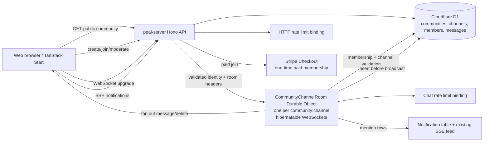

# Communities architecture

The Durable Object is a coordination and fan-out layer, not a second source of truth. Every accepted message is written to D1 before it is broadcast. Objects are named deterministically by `communityId:channelId`, so busy channels shard across objects and idle channels hibernate. The API authenticates and authorizes the WebSocket upgrade before forwarding it to the object; the object rechecks membership on every message.

Public communities expose channel metadata and message history without a session. Private communities return `404` to non-members to avoid leaking their existence. Only users with an active Creator entitlement can create a community. Paid membership uses a real Stripe Checkout session and is activated only after the server verifies the completed, paid session metadata.
