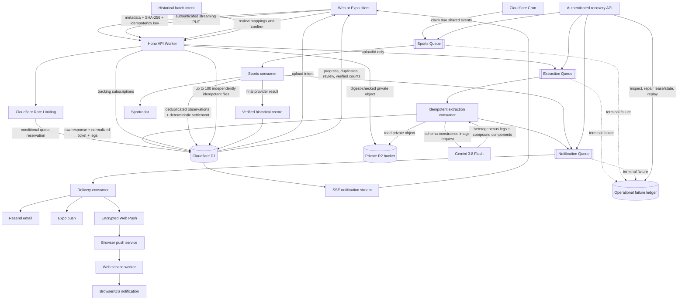

# Upload processing architecture

This is the implemented Cloudflare upload path for live slips and Creator historical batches. Every asynchronous transition is persisted before it is queued, and every side effect has an idempotency key.

## Reliability boundaries

- D1 is the source of truth; queue messages contain identifiers, never images or secrets.
- Upload quota reservation, SHA-256 deduplication, observation identity, timeline transitions, referrals, webhook receipts, and notification delivery all have unique idempotency keys.
- R2 is private and stores only server-generated object keys. The upload endpoint validates ownership, declared length, MIME type, and the SHA-256 digest supplied at intent creation.
- A sports event is fetched once per polling interval and fans out to every subscribed leg. This is the key scaling property: provider traffic grows with active events, not users.
- Terminal queue failures are written to `operation_failures`. Replay repairs extraction state/quota or sports leases before enqueueing again, rather than blindly duplicating work.
- Live updates use reconnectable SSE backed by durable notification rows. Email, Expo push, and encrypted browser Web Push delivery run independently through the notification queue; expired browser subscriptions are pruned automatically.
- Browser push subscriptions are authenticated, stored per user in D1, and accepted only for known HTTPS push-service hosts. The VAPID private key is a Worker secret; the public key is returned only to authenticated clients for subscription.

## Provider coverage

The catalog includes NBA, WNBA, NCAA basketball, NFL, NCAA football, MLB, NHL, soccer, tennis, MMA, global basketball/football/baseball/hockey, NASCAR, Formula 1, and PGA. The configured Sportradar key currently authorizes the tested NBA and MLB feeds. It returns `403` for the tested NFL, NHL, soccer, tennis, MMA, global basketball, NASCAR, Formula 1, and PGA products. Those adapters are implemented and fixture-tested, but production calls require those product entitlements on the provider account.
